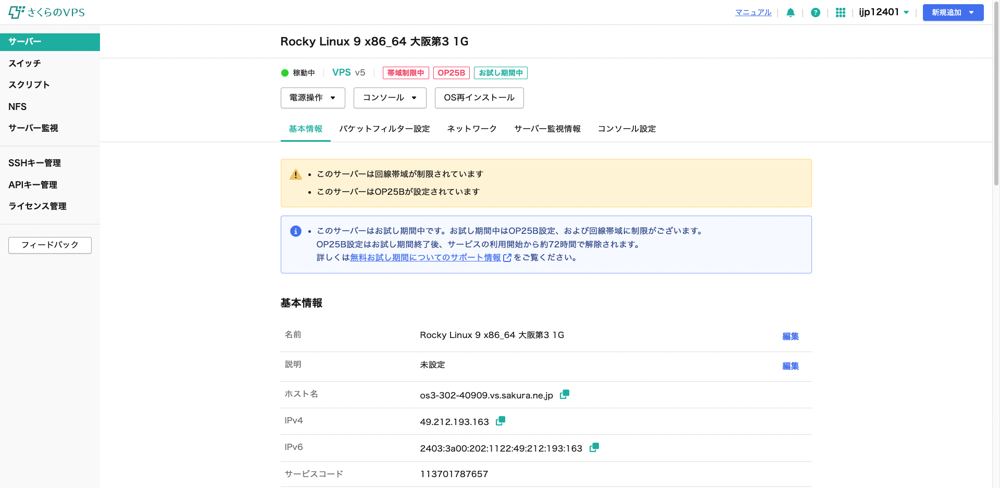
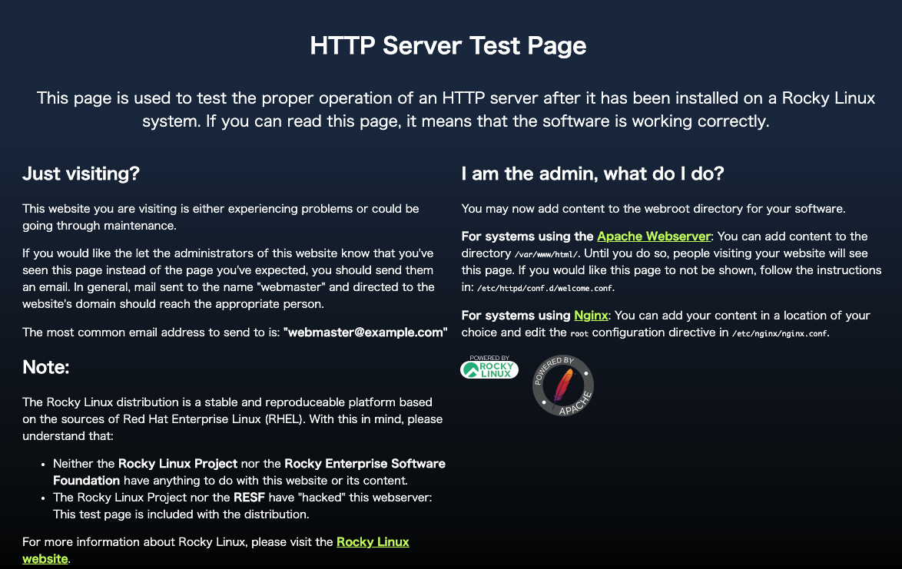
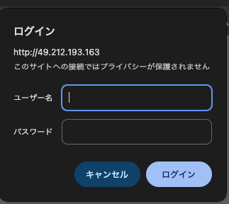
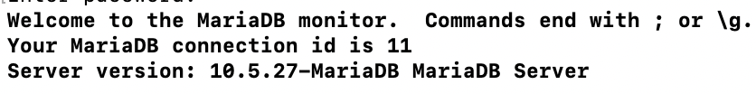
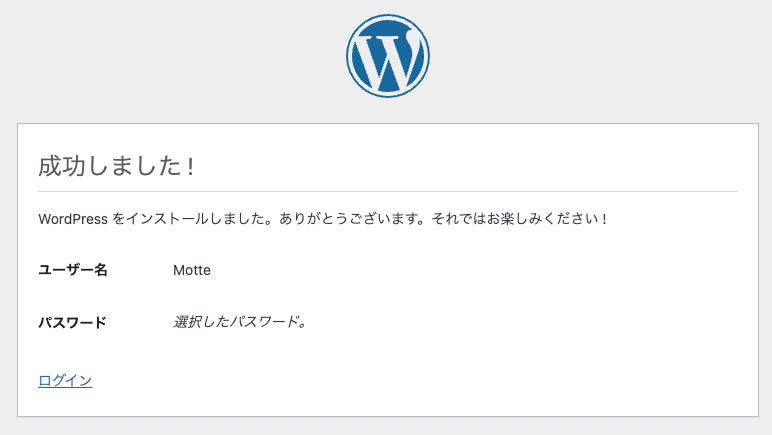
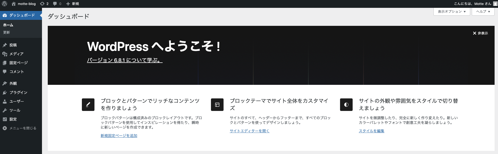

# -VPS-LAMP-
さくらVPS上にLAMP環境を構築し、WordPressのセットアップまで行ったハンズオン学習記録です。

---
## 使用技術

- Linux （Rocky Linux）
-　Apache
-　MariaDB
-　PHP
-　WordPress

---

## 学習の流れ
本プロジェクトでは、以下の順序でLAMP環境構築およびWordPress導入を行いました。
01. さくらVPS準備・接続(SSH) 
02. Apacheサーバー構築(インストール&起動)
03. Apache Basic認証の設定と動作確認
04. PHPのインストールとApacheとの連携確認
05. MariaDBのインストールと接続確認
06. WordPressのダウンロードとインストール
07. WordPressログイン画面の表示・管理画面へのアクセス

---

## セットアップ手順

### 01.さくらVPS準備・接続
さくらのVPSで仮想サーバーを用意し、SSH接続を行いました。

### 02.Apacheサーバー構築(インストール＆起動)
Apacheをインストールし、Webサーバーとして起動・有効化を行いました。

### 03.Apache Basic認証の設定と動作確認
ディレクトリに対してBasic認証を設定し、アクセス時にユーザー名・パスワードの入力が求められることを確認しました。

### 04.PHPのインストールとApacheとの連携確認
PHPをインストールし、Apache上でPHPが正しく動作することを確認しました。

### 05.MariaDBのインストールと接続確認
MariaDBをインストール後、初期設定と接続確認を行いました。

### 06.WordPressのダウンロードとインストール
WordPressの最新版をダウンロードし、Apacheのドキュメントルートに展開しました。

### 07.WordPressログイン画面の表示・管理画面へのアクセス
WordPressのインストール完了後、ログイン画面が正しく表示されること、管理画面へアクセスできることを確認しました。

## 私が学んだこと
### 1.Linuxサーバーの基本操作
・SSH接続によるリモート管理
・パッケージのインストールとサービス起動

### 2.Webサーバーの構築
・Apacheの導入と設定方法
・PHPとの連携確認
・Basic認証の導入とアクセス制御の方法

### 3.データベース操作の基礎
・MariaDBのインストール
・データベース作成と接続確認方法

### 4.WordPressの導入と動作確認
・CMSの仕組みの理解
・初期設定、ログイン、管理画面の確認

### 5.技術文書
Markdownを使用してプロジェクトを明確に文書化する方法(画像の埋め込み)

## 今後の取り組み

・公開サーバーの最低限のセキュリティ対策を学ぶ
・Dockerの基本概念を学習し、LAMP環境をDocker化して再構築

